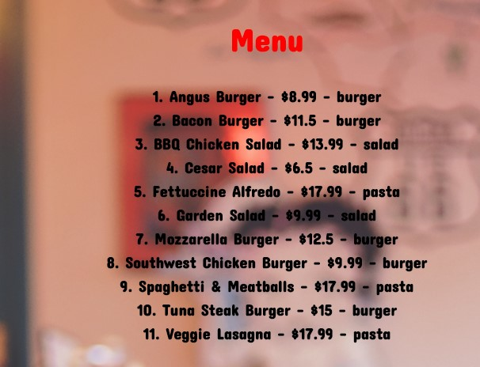

# **Alan-AI-Cart**

---
## **Description:**
#### **_This is a React voice interaction app using Alan-Ai <https://alan.app/>."_**
---
## **Example Gif:**

## **Link to the video: <https://drive.google.com/file/d/1JxHXAqHEdSFJp7rCixzDWXpDnXCqDiic/view>**

---
## **Guidline:**
### 1. Start: 
#### -Follow the link: <https://ahnlok.github.io/react-ai-cart/>
 

### 2. Main Page:
#### 1. Click the button to start

 

#### 2. Say "Show me the menu"
##### _Alan-AI will bring out a list of menu items on 'Menu' tab._

#### _There are several command you can say after brought out the menu_
##### _ex) You can say "Order by name", "Order by price", and "Order by category"_
 

### 3. Add Items To The Cart:
#### _Once you decided to add certain item to the cart, simply say "Add (item name) to the cart"_
#### _You will recognize Alan-AI transferred your called item into the 'Cart' section_
 

## **Breakdown of the Codes:**
## **_Alan-AI Code:_**
#### _1. Opening Command ("Show me the menu"):_
    intent('show me the menu', p => {
        p.play({command: 'getMenu', data: menuItems})
        p.play("Here's the menu");
    });
#### _2. "Sort By" Commands ("Order by Name|Price|Category"):_
    intent('order by $(ORDER_BY name|price|category)', p => {
    const orderByField = p.ORDER_BY.value;
    let orderedMenuItems = menuItems;
    switch(orderByField) {
       //sort the name by alphatical order
        case 'name':
            orderedMenuItems = menuItems.sort((p1, p2) => p1.name.localeCompare(p2.name));
            break;
        //Sort by category
        case 'category':
            orderedMenuItems = menuItems.sort((p1, p2) => p1.category.localeCompare(p2.category));
            break;
         //Sort by price
        case 'price':
            orderedMenuItems = menuItems.sort((p1, p2) => p1.price - p2.price);
            break;
    } 
    p.play({command: 'getMenu', data: orderedMenuItems});
    p.play(`Ordering by ${p.ORDER_BY.value}`);
    });
#### _3. "Adding items to the Cart" Command ("Add (item-name) to the cart")"_
    intent(`Add $(ITEM ${menuITemsSlotList}) to the cart`, 
       'Add $(UNAVAILABLE_ITEM* .*) to the cart',
       p => {
    if(p.UNAVAILABLE_ITEM) {
        p.play(`That item is unavailable`);
    } else {
           const itemName = p.ITEM.value;
           const itemToGoInCart = menuItems.find((menuItem) => {
               return menuItem.name.toLowerCase() === itemName.toLowerCase();
    })
        p.play({command: 'addToCart', data: itemToGoInCart});
        p.play(`Adding ${p.ITEM.value} to the cart`);
    }
    });
---
 

## **_React Code in VS Code_**
#### _1. JSON Data used:_
    const menuItems = [
    {name: "Angus Burger", price: 8.99, category: 'burger'},
    {name: "Tuna Steak Burger", price: 15.00, category: 'burger'},
    {name: "Bacon Burger", price: 11.50, category: 'burger'},
    {name: "Southwest Chicken Burger", price: 9.99, category: 'burger'},
    {name: "Mozzarella Burger", price: 12.50, category: 'burger'},
    {name: "Cesar Salad", price: 6.50, category: 'salad'},
    {name: "BBQ Chicken Salad", price: 13.99, category: 'salad'},
    {name: "Garden Salad", price: 9.99, category: 'salad'},
    {name: "Veggie Lasagna", price: 17.99, category: 'pasta'},
    {name: "Spaghetti & Meatballs", price: 17.99, category: 'pasta'},
    {name: "Fettuccine Alfredo", price: 17.99, category: 'pasta'},
    ];
#### _2. Linking with Alan-AI codes:_
    alanBtn({ 
        key: '9298c5e0f50206b31f16ca738b3fb5a62e956eca572e1d8b807a3e2338fdd0dc/stage',
        onCommand: (commandData) => {
            // Whenever user says 'Show me the menu' we would like Alan-ai to return the menu 
            if(commandData.command === 'getMenu') {
            setMenuItems(commandData.data);
            } else if (commandData.command === 'addToCart') {
            addToCart(commandData.data);
            }
        },
        });
    }, [])
#### _3. React Hooks used:_
    const [cart, setCart] = useState([])
    const [menuItems, setMenuItems] = useState([])
#### _4. Mapping through menuItems:_
    <h2 className="menu_title">Menu</h2>
        {menuItems.map((menuItem) => (
        // key will be the 'name'
        // This is the menu items that the user will see
        <li key={menuItem.name} className="menu_list">
            {menuItem.name} - ${menuItem.price} - {menuItem.category}
        </li>
        ))}
#### _5. Add items to the cart:_
    const addToCart = (menuItem) => {
        setCart((oldCart) => {
        // Return all the items from 'oldCart' + menuItems
        // Spread operator: '...'
        return [...oldCart, menuItem]
        })
#### _6. Mapping through cartItems (after added):_
    <h2 className="cart_title">Cart</h2>
        {/* Mapping through 'cart items' */}
        {cart.map((cartItem) => (
        // This will the 'cart item' user will see
        <li key={cartItem.name} className="menu_list">
            {cartItem.name} - ${cartItem.price} - {cartItem.category}
        </li>
---
 

## **Installation**
### **_git clone: <git@github.com:ahnlok/react-ai-cart.git>_**

---
## **Credit**
### **Mike Dane**
### _AI Powered Shopping Cart_: 
### <https://www.mikedane.com/web-development/javascript/ai-shopping-cart/>
---

## **GitHub**
### **_GitHub_**: **<https://github.com/ahnlok/react-ai-cart>**
### **_Deployed Github Site_**: **<https://ahnlok.github.io/react-ai-cart/>**

---

## **Contact**
### **_E-Mail_**: **<ansungpil1@gmail.com>**
### **_LinkedIn_**: **<https://www.linkedin.com/in/an-sungpil-95ab8490/>**
### **_GitHub_**: **<https://github.com/ahnlok>**

---
## **License**
### **© Sungpil An 2021**

#### _Licensed under the MIT License_